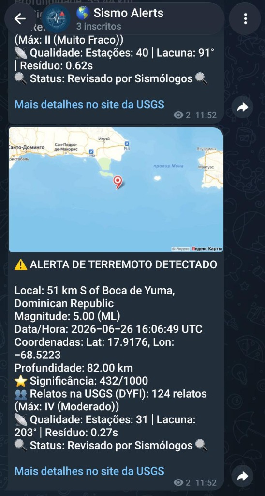

# Sismo - Monitoramento Global e Alertas Rápidos de Terremotos

O **Sismo** é uma plataforma desenvolvida para monitorar a atividade sísmica mundial e publicar alertas automáticos e ricos em informação, com alta velocidade, em um canal público do Telegram.

  

---

## Objetivo do Projeto

Oferecer informações ágeis, precisas e acessíveis sobre tremores de terra globais, integrando continuamente os dados oficiais da USGS e republicando-os de forma clara e visual para qualquer pessoa inscrita no canal.

---

## Principais Funcionalidades

### 1. Alertas Globais Filtrados
- Integração contínua com a API do **USGS (United States Geological Survey)**.
- Monitoramento contínuo em escala global.
- Alerta automático para eventos de magnitude relevante (acima de 4.5).
- Deduplicação por cache em memória para evitar alertas repetidos do mesmo evento.

### 2. Publicação Rica em Detalhes no Canal do Telegram
- Cada alerta publicado inclui local, magnitude (com tipo), data/hora, coordenadas, profundidade, alerta PAGER, significância, relatos "Did You Feel It?" da USGS, intensidade estimada (MMI), métricas de qualidade da leitura (estações, lacuna, resíduo) e status de revisão.
- Eventos com risco de tsunami recebem um destaque visual especial na mensagem.

### 3. Visualizações Geográficas Dinâmicas (Mapas)
- **Visualização Direta no Telegram**: toda notificação anexa automaticamente um mapa estático da área do epicentro com um marcador vermelho no centro, gerado via **Yandex Static Maps API**.
- **Visualização Interativa Avançada**: cada alerta inclui o link `"Mais detalhes no site da USGS"`, que leva à página oficial do evento com mapa interativo 3D, placas tectônicas e estações sismográficas próximas.
- **Resiliência de Envio**: o despachador de alertas possui fallback automático — se o servidor de mapas falhar ou estiver inacessível, a publicação é rebaixada para texto simples, garantindo que o alerta chegue sem atrasos.

### 4. Despacho com Controle de Vazão
- Fila assíncrona de publicações com *rate limiting* (1 msg/s) para respeitar os limites da API do Telegram.

---

## Arquitetura do Sistema

O projeto é escrito em **Go** e estruturado segundo boas práticas de modularização:
- **`cmd/monitor`**: ponto de entrada do executável principal do monitoramento.
- **`internal/usgs`**: cliente de consumo e parsing da API do USGS.
- **`internal/filter`**: lógica de filtragem por magnitude/bounding box e deduplicação de eventos já notificados.
- **`internal/notifier`**: dispatchers de alerta (Telegram, Console) com fila assíncrona e controle de vazão (rate limiting).
- **`internal/server`**: servidor HTTP que serve os arquivos estáticos da landing page.
- **`web`**: interface da landing page (HTML e CSS puro).

